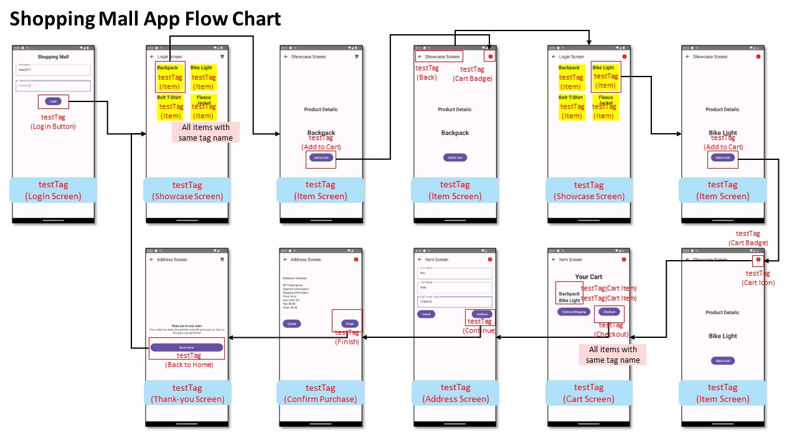
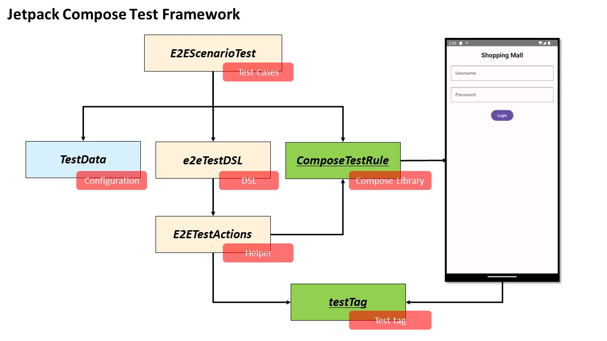
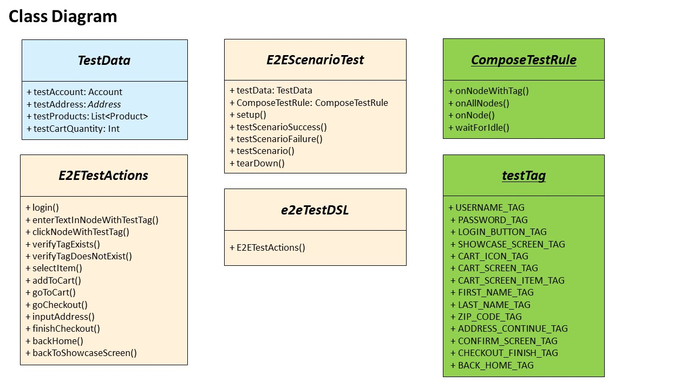
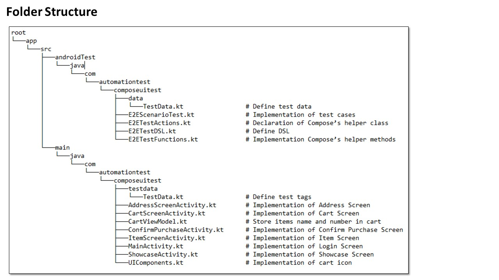
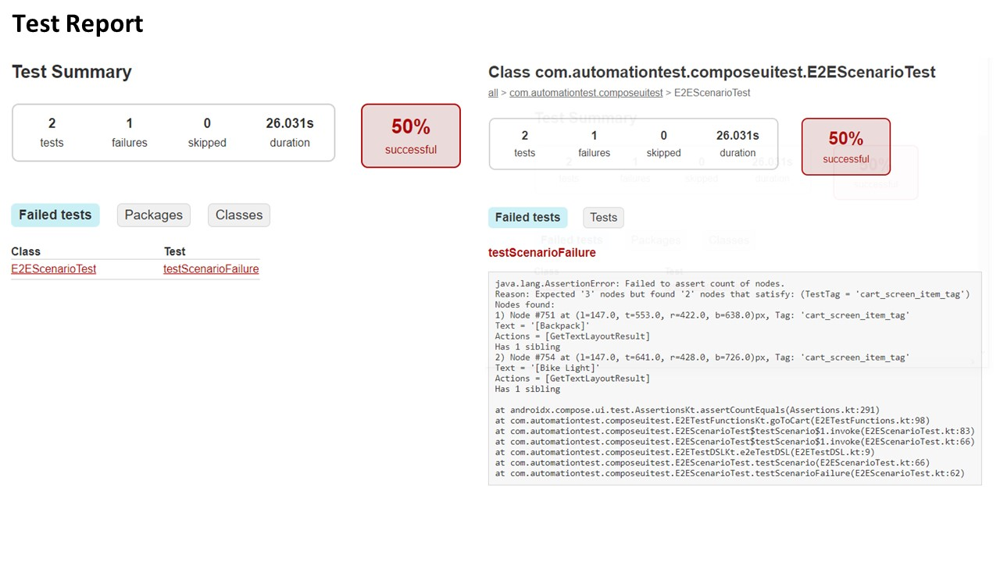

<p align="right">
  
</p>

# Jetpack Compose UI Testing Framework

An detailed explanation of the implementation from scratch of an automated testing framework to verify the purchasing flow for the Android Shopping Mall application.

## Scenario 1:

### 1. Reference APP: Shopping Mall
First, implement a reference application used to verify the purchasing flow in the application using the Jetpack Compose library.

I have implemented screens as above and inserted test tags into each screen and some UI components:

1. **Login Scren**: Insert test tags of   `Login screen ` and  `Login Button `.
2. **Top Bar**: Add  `Back Key ` and  `Cart Icon ` on Top bar.
3. **Cart Icon**: Add test tags of   `Cart Icon Button ` and  `Cart Badge `.
4. **Showcase Screen**: Insert test tags of   `Showcase Screen ` and  `All items `. 
5. **Item Screen**: Insert test tags of   `Item screen ` and  `Add to Cart Button `.
6. **Cart Screen**: Insert test tags of   `Cart screen `,  `Checkout Button ` and  `All Cart Items `.
7. **Address Screen**: Insert test tags of  `Address screen ` and  `Continue Button `.
8. **Confirm Purchase**: Insert test tags of  `Confirm Purchase screen ` and  `Finish Button `.
9. **Thank-you Screen**: Insert test tags of  `Thank-you screen ` and  `Back Home Button `.

### 2. Automated Testing Framework
Next, implement an automated testing framework using the Jetpack Compose testing library.



1. **TestData.kt**: Define test data.
2. **E2EScenarioTest.kt**: Implementation of test cases.
3. **E2ETestActions.kt**: Declaration of Compose’s helper class.
4. **E2ETestDSL.kt**: Define DSL.
5. **E2ETestFunctions.kt**: Implementation Compose’s helper methods.

### 3.  E2E Test Scenarios
Next, write an E2E test to verify the purchasing flow in the application using the Jetpack Compose testing library.



- **Login**: Use the helper method to enter login credentials and click the login button.
- **Showcase Screen**: Verify the showcase screen, select the first item.
- **Item Screen**: Add the selected item to the cart.
- **Back to Showcase Screen**: Select the second item and add it to the cart.
- **Cart Screen**: Verify two items are in the cart and start the purchase flow.
- **Address Screen**: Fill in the address details and continue to the Confirm Purchase Screen.
- **Confirm Purchase Screen**: Finish the purchase and verify success.

In code, it can look something like this (using DSL style):

```kotlin
e2eTestDSL(composeTestRule) {
    login(account)
    selectItem(0).addToCart("1")
    backToShowcaseScreen().selectItem(1).addToCart("2")
    goToCart(2).inputAddress(address).finishCheckout()
    verifyTagExists(TestTags.THANK_YOU_SCREEN_TAG)
}
```
### 4.  Design Pattern and Folder Stucture
The file structure and design pattern can follow the earlier mentioned folder structure.



### 5.  Test Result and Report
Run /gradlew connectedAndroidTest and get a report, write two test cases and detect an issue with one.


## Scenario 2: 

### 1. Navigating between Screens
  a. **Identifying Screen Transition**:

1. Verify the existence of specific UI elements or tags that are unique to the new screen..
```kotlin
// Verify the existence of a node with the expected test tag
composeTestRule.onNode(hasTestTag(expectedTag)).assertExists()
```
2. In cases of slow network connection, using composeTestRule.waitForIdle() allows waiting until the UI is idle.
```kotlin
composeTestRule.waitForIdle()
```
 
  b. **Internal Method Implementation**:

Here is a generic method to handle screen transitions, available across all screens. It can log the current screen after ensuring it's loaded.
```kotlin
composeTestRule.waitUntil(
    condition = { composeTestRule.onNodeWithTag("Next Screen").assertExists() },
    screenName = "Next Screen"
)
Log.d("ScreenTransition", "Transitioned to $screenName")
```

### 2. Jetpack Compose Requirements
  a. **Before Test Starts**:
1. Mark the UI Screen or Component with test tags by `Modifier.testTag(tag) `.
2. Set up the ComposeTestRule and initialize it with the start activity.
3. Initiate the test data with specific data that is used to test.
4. Start up the app and 

    
### 3. Items In Cart
  a. **Item Quantity Assertion**:
1. Insert test tags to items that are added to the cart with the same tag name.
2. Verify the tag node numbers that match the tag name mentioned in step 1.
```kotlin
// Verify the number of items in the cart matches the expected quantity
val cartScreenNodes = composeTestRule.onAllNodes(hasTestTag(TestTags.CART_SCREEN_ITEM_TAG))
cartScreenNodes.assertCountEquals(expectedQuantity)
```

## Contact

- 2023.08.08: Learn Jetpack Compose library
- 2023.08.09: Implement Shopping Mall APP
- 2023.08.10: Implement automated testing framework and E2E test cases

## Note
### Timeline
- 2023.08.08: learn Jetpack Compose library
- 2023.08.09: implement Shopping Mall APP
- 2023.08.10: implement automated testing framework and E2E test cases
