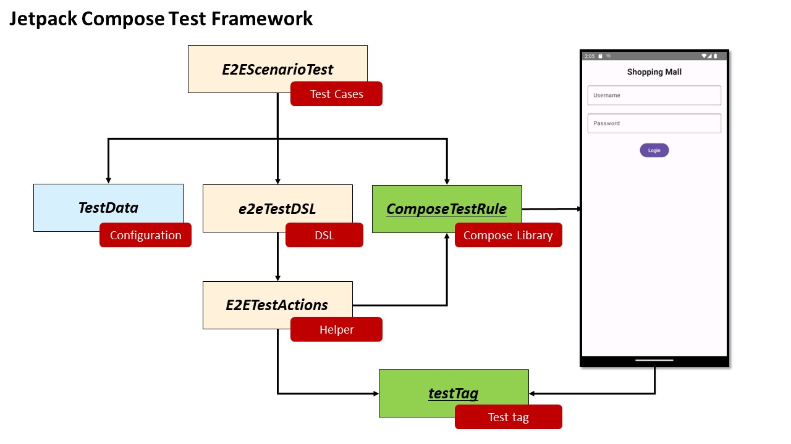

<p align="right">
  
</p>


# Jetpack Compose UI Testing for E2E Purchase Flow

A detailed explanation of the end-to-end (E2E) purchase flow testing using Jetpack Compose from scratch for the Android application.

## Scenario 1: E2E Test for Purchase Flow

For this scenario, I'll write an E2E test to verify the purchasing flow in the application using the Jetpack Compose testing library.

1. **Login**: Use the helper method to enter login credentials and click the login button.
2. **Showcase Screen**: Verify the showcase screen, select the first item.
3. **Item Screen**: Add the selected item to the cart.
4. **Back to Showcase Screen**: Select the second item and add it to the cart.
5. **Cart Screen**: Verify two items are in the cart and start the purchase flow.
6. **Address Screen**: Fill in the address details and continue to the Confirm Purchase Screen.
7. **Confirm Purchase Screen**: Finish the purchase and verify success.

In code, it can look something like this (using DSL style):

```kotlin
e2eTestDSL(composeTestRule) {
    login(account)
    selectItem(0).addToCart("1")
    backToShowcaseScreen().selectItem(1).addToCart("2")
    goToCart(2).inputAddress(address).finishCheckout()
    verifyTagExists(TestTags.THANK_YOU_SCREEN_TAG)
}
```

The file structure and design pattern can follow the earlier mentioned folder structure.





## Scenario 2: Foundations for the Framework

### 1. Navigating between Screens
  a. **Identifying Screen Transition**: You can verify the existence of specific UI elements or tags that are unique to the new screen. In cases of slow network connection, using `composeTestRule.waitForIdle()` allows you to wait until the UI is idle.
  b. **Internal Method Implementation**: You can create a generic method to handle screen transitions, available across all screens. It can log the current screen after ensuring it's loaded.

### 2. Jetpack Compose Requirements
  a. **Before Test Starts**:
    i. You'll need to set up the ComposeTestRule and initialize it with the activity you want to test.
    ii. Consider any setup needed for screen transitions as discussed in point 1 of Exercise 2.

### 3. Bonus Point (5a) Thoughts
  a. **Item Quantity Assertion**: It's an excellent addition to the test, ensuring that the functionality of adding items to the cart is working correctly. It adds an extra layer of verification and makes the test more robust against potential issues.

## Contact

- GitHub: [Kaku0217](https://github.com/Kaku0217/JetpackCompose.git)
- Your Email: [hou.kaku@gmail.com](mailto:hou.kaku@gmail.com)

## Note

